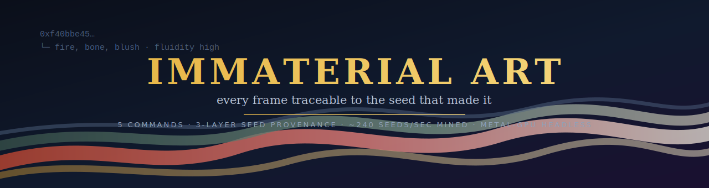
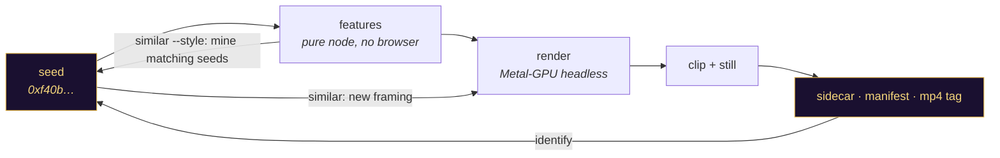
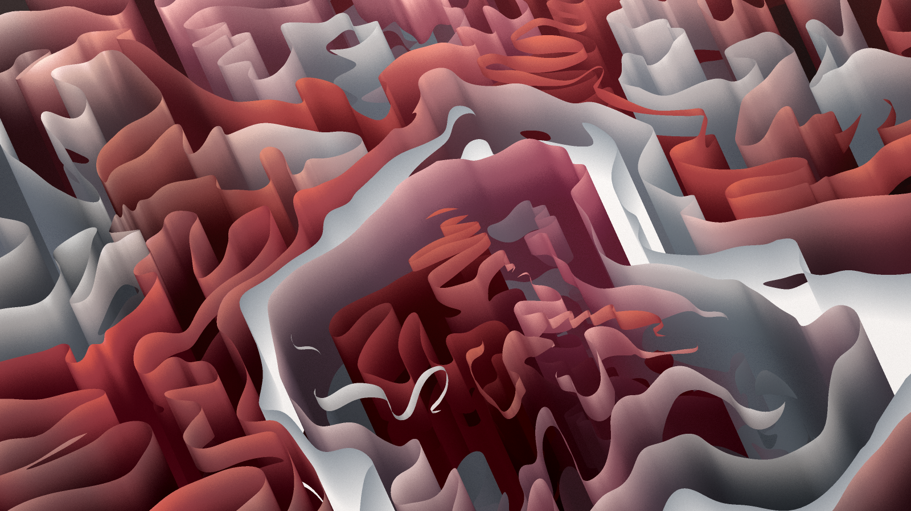
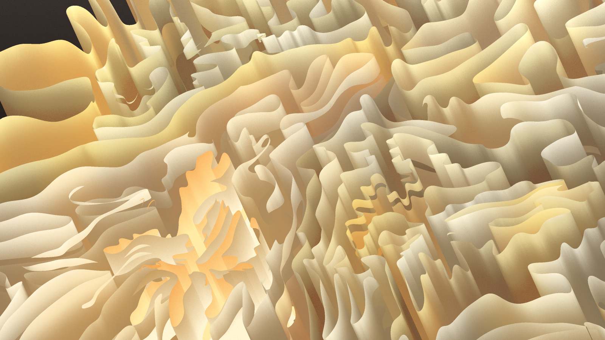
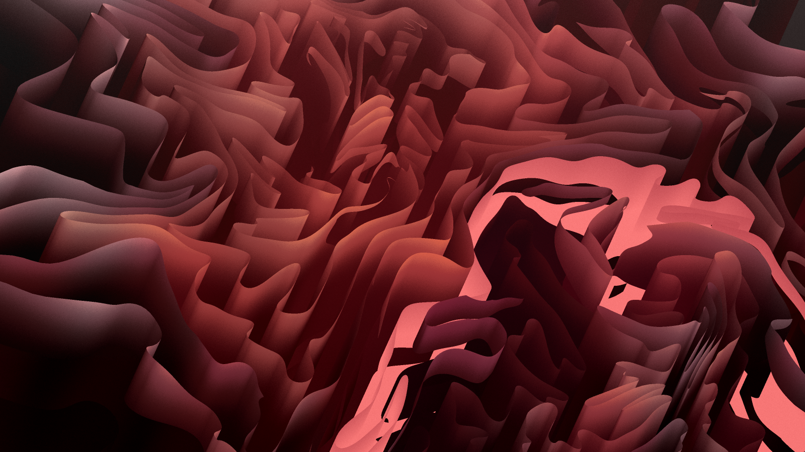
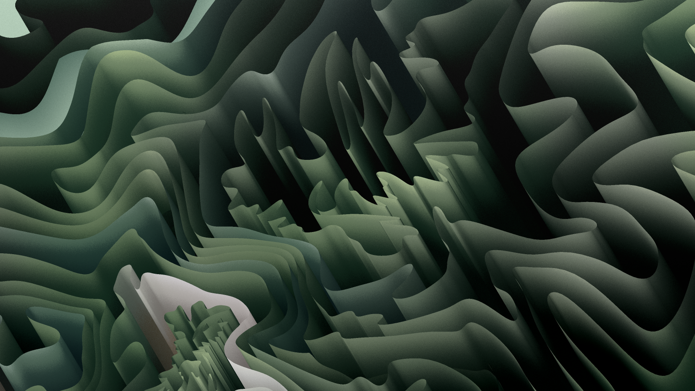
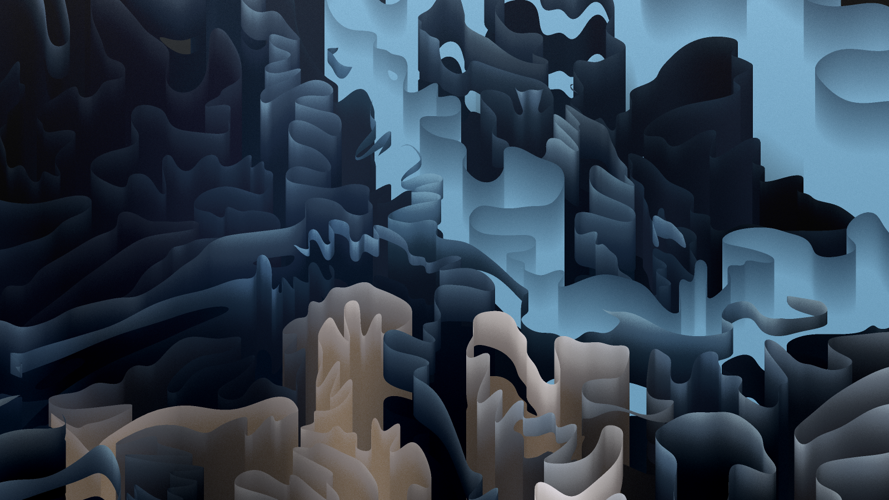
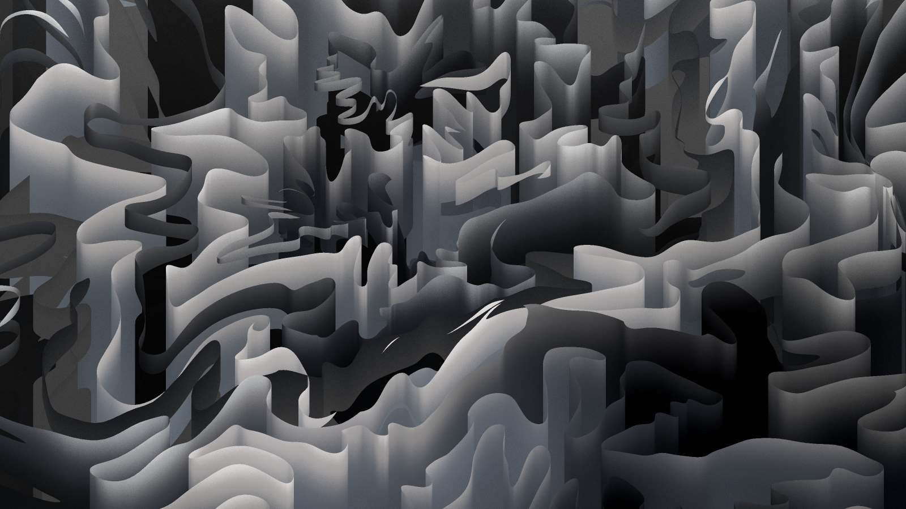
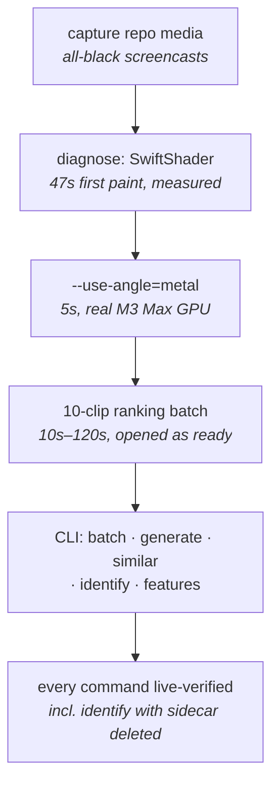

<div align="center">


[-blue)](LICENSE)
[](#-every-file-knows-its-seed)
[](#-similar--coherent-shots-for-one-video)
[](#-hard-won-gotchas-why-this-exists)
[](#-how-it-was-built)
[](skill/SKILL.md)
[](https://github.com/fire17/immaterial-art)

<i>b-roll that can always be regenerated — because every render carries the seed that made it.</i>


**[⚡ Quickstart](#-quickstart)** · **[🎬 Commands](#-the-five-commands)** · **[🧬 Provenance](#-every-file-knows-its-seed)** · **[🎯 Coherent shots](#-similar--coherent-shots-for-one-video)** · **[🔧 Gotchas](#-hard-won-gotchas-why-this-exists)**

</div>

## 🧬 Every file knows its seed

Hash-seeded generative art is deterministic: one 64-hex seed = one exact artwork, forever. This pipeline makes that determinism **operational** — every clip and still it renders is traceable back to its seed through three independent layers:

- **Sidecar JSON** beside every render — seed, derived features (palette, fluidity, fidelity…), exact render params.
- **`manifest.jsonl`** per output dir — the batch's full ledger.
- **The seed embedded in the mp4 itself** (`comment` metadata tag) — verified live: deleted the sidecar, `identify` still recovered the seed from the file alone.

> [!IMPORTANT]
> Pick a clip you rendered months ago and say "give me this same artwork, zoomed in, square, 2 minutes long" — `identify` recovers the seed, `similar` re-renders it in any framing. Footage stops being footage and becomes a reproducible function.



## 🖼 What it renders

Six generations, six seeds — every one reproducible from the hash in its sidecar (all captured by this pipeline on an M3 Max):

| | | |
|---|---|---|
|  |  |  |
|  |  |  |

🎬 **[48-second montage — 8 generations back-to-back](media/montage.mp4)** (the meshes flow continuously; each page load without a seed is a brand-new artwork).

## ⚡ Quickstart

```bash
git clone https://github.com/fire17/immaterial-art && cd immaterial-art && ./install.sh
node ~/.claude/skills/immaterial-art/scripts/immaterial.mjs batch \
  --count 2 --duration 5 --stills --out /tmp/imm-test --open-as-ready
```

Each render pops open the moment it finishes. Requirements: node ≥ 18, `ffmpeg`/`ffprobe` (brew), macOS with a real GPU, and a local checkout of a compatible engine (`--repo` points at it — see [license note](#-license)).

Claude Code users: `./install.sh` also links the **`/immaterial-art`** skill (alias **`/iart`**) — then just ask for "10 clips of b-roll, open them as they render".

## 🎬 The five commands

| Command | What it does | The line you'll actually run |
|---|---|---|
| `batch` | N random generations → numbered clips/stills | `batch --count 10 --duration 120 --out ./renders --open-as-ready` |
| `generate` | one render, chosen or random seed | `generate --hash 0xf40b… --duration 30 --stills` |
| `similar` | alternate shots: same seed, new framing — or new seeds, same style | `similar --from 007_ab12cd34.mp4 --count 5` |
| `identify` | any rendered file → the seed that made it | `identify old-clip.mp4` |
| `features` | seed → derived features, instant, no browser | `features 0xccc4…` |

<details>
<summary><b>All options (parametric everything)</b></summary>

- `--count N` — how many generations
- `--duration SECS` (uniform) or `--durations 10,30,60,120` (cycles per clip — mixed-length batches)
- `--ratio` — height/width: `0.5625` = 16:9, `1` = square, `0.1875` = ultra-wide gallery banner
- `--width` / `--height` — output resolution
- `--scale` — zoom into the artwork (engine default 2; higher = closer, denser detail)
- `--stills` (PNG alongside video) / `--images-only` (no video)
- `--open-as-ready` — macOS `open` each file as it completes; queue a batch, watch it arrive
- `--prefix`, `--seq-start` — naming control for stitchable sequences
- `--out DIR`, `--repo PATH`, `--hash 0x…`
- `similar` extras: `--ratios a,b,c` + `--scales a,b,c` sweep framings; `--style` mines new seeds; `--match "color scheme+fluidity+fidelity"` tightens the style match

</details>

## 🎯 similar — coherent shots for one video

The reason this tool exists: **multiple takes that belong to the same film.**

```bash
# same generation, five framings (zoom/aspect sweeps) — cutaways that match
similar --from renders/007_ab12cd34.mp4 --count 5 --duration 60 --out ./takes

# five DIFFERENT generations wearing the same palette — variety that still matches
similar --from renders/007_ab12cd34.mp4 --style --count 5 --duration 120 --out ./siblings
```

Style-mining runs the engine's feature-derivation in pure node — **~240 seeds/sec measured** (each call includes the engine's 1,000,000-iteration PRNG warmup). Live run: 2 seeds matching `fire,bone,blush` found in 90 tries, both rendered and confirmed on-palette.

## 🔧 Hard-won gotchas (why this exists)

Each of these produced silent black video before it was found:

1. **Headless Chromium defaults to SwiftShader.** First WebGL paint: **~47 seconds** (measured), and screencast video stays black the whole time. `--use-angle=metal` uses the real GPU: **~5 seconds**. This single flag is the difference between a working pipeline and an all-black one.
2. **WebGL canvas element-screenshots return black** regardless. The pipeline polls full-page screenshots (>100KB ⇒ painted), then ffmpeg-trims the pre-paint lead-in from the recording.
3. **A 404'd module import silently kills URL params.** The engine's `?hash=` handler lives in a module that imports `goerli-hashes.js`; if that file is missing, every render is random no matter what seed you pass.
4. Batches render **sequentially on purpose** — parallel contexts contend for the GPU and stutter the screencast. Recording is realtime: a 120s clip takes ~120s + ~12s overhead.

## 🛠 How it was built

Built in one Claude Code session (2026-07-10) that started as "add a README to this art repo" and ended as a provenance pipeline:



Defects the process caught before ship: black element-screenshots (worked around with full-page paint polling), a comma-operator bug in the trim math (caught in review), the silent `?hash=` breakage (root-caused to the module 404), a duplicate vault copy (deduped).

## 🛡 Safety & undo

| Concern | Answer |
|---|---|
| What install.sh touches | two symlinks in `~/.claude/skills/` + `npm install` inside this repo |
| What it never touches | your renders, your engine checkout, anything outside this repo & the two links |
| Uninstall | `rm ~/.claude/skills/immaterial-art ~/.claude/skills/iart` |
| Renders | always written to the `--out` you name; nothing is ever deleted or moved |

## ⭐ If this saved you a reshoot

Every render here is reproducible by design — a star marks the seed so other people can find it. If the provenance trick (mp4s that remember how to remake themselves) is useful to you, star it forward.

[](https://star-history.com/#fire17/immaterial-art&Date)

## 📜 License

**MIT — for the tooling in this repo only.** The Immaterial Fornebu engine this pipeline drives is [Bjørn Staal](https://github.com/bgstaal)'s artwork; it is **not included**. Obtain it separately and respect its terms. Sibling project: [entangled-grail](https://github.com/fire17/entangled-grail) — the recovery of Staal's Entangled.

---

<div align="center"><sub><i>a seed is a promise: the same art, any time, any framing.</i></sub></div>
